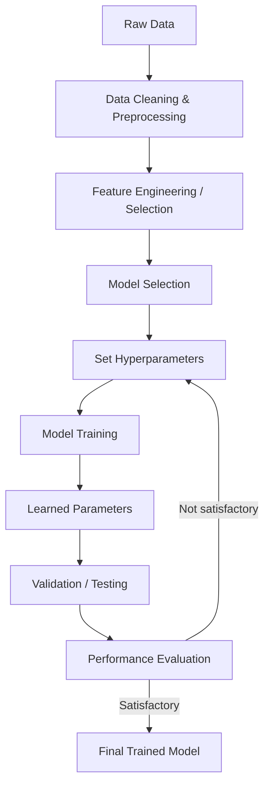

# ML Training Pipeline

**Description:** Iterative process: prepare data → choose model & hyperparameters → train → evaluate → tune.

**Notes:** Hyperparameters set _before_ training; parameters learned _during_ training. Loop = hyperparameter tuning. Reflects production ML pipelines.
